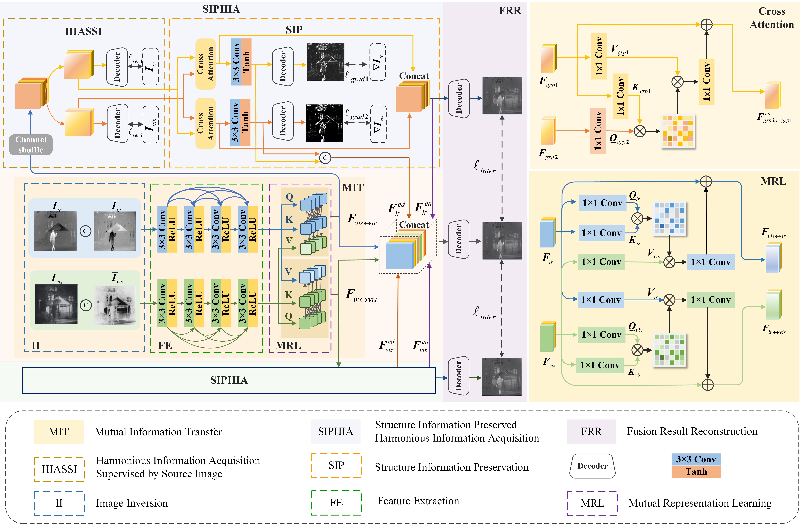
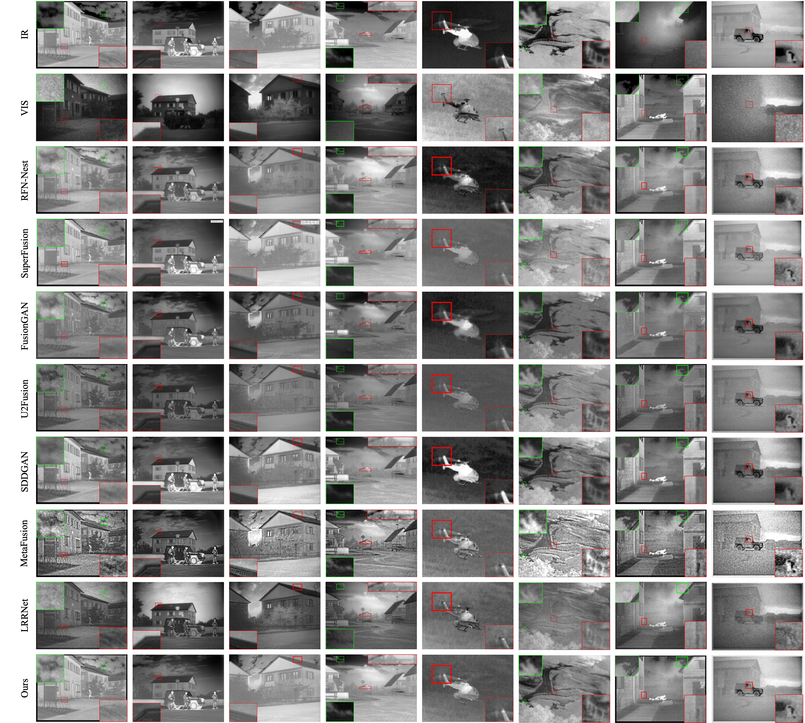

#  CHITNet: A Complementary to Harmonious Information Transfer Network for Infrared and Visible Image Fusion
- [arxiv](https://arxiv.org/abs/2309.06118 )

---
## Framework

---
###  
```bash
We use a single NVIDIA RTX3090 GPU for training and evaluation.
```

## Recommended Environment
We strongly recommend that you use Conda as a package manager.

```shell
# create virtual environment
conda create -n CHITNet python=3.10
conda activate CHITNet
pip install -r requirements.txt
```

## Prepare Datasets
```bash
mkdir data
```

Download the datasets **RoadScene**, **TNO**, **VOT2020-RGBT**, **OTCBVS**.
you can find the *RoadScene* in [[RoadScene]](https://github.com/hanna-xu/RoadScene) [1], 
*TNO** in [[TNO]](https://figshare.com/articles/TNO_Image_Fusion_Dataset/1008029) [2],
and *VOT2020-RGBT** in [[VOT2020-RGBT]](http://data.votchallenge.net/vot2020/rgbtir/meta/description.json) [3],
*OTCBVS** in [[OTCBVS]](http://vcipl-okstate.org/pbvs/bench/) [4].

Organize them in `your dataset root dir` folder as follows:

```
|-- your dataset root dir/
|   |-- <train>/
|       |-- vis
|               |-- 1.jpg
|               |-- 2.jpg
|               |-- 3.jpg
|        |-- lr
|               |-- 1.jpg
|               |-- 2.jpg
|               |-- 3.jpg
|   |-- <Test>/
|       |-- TNO
|           |-- vis
|               |-- 1.bmp
|               |-- 2.bmp
|               |-- 3.bmp
|            |-- lr
|               |-- 1.bmp
|               |-- 2.bmp
|               |-- 3.bmp
|       |-- VOT2020-RGBT
|            |-- vis
|            |-- lr
|       |-- OTCBVS
|            |-- vis
|               |-- img_00001.bmp
|               |-- img_00002.bmp
|               |-- img_00003.bmp
|            |-- lr
|               |-- img_00001.bmp
|               |-- img_00002.bmp
|               |-- img_00003.bmp
```


## To Train
The training code is provided here.

If you want to train the network : Run "**CUDA_VISIBLE_DEVICES=0 python train_fusion.py**".

## To Test
The test code is also provided here.

If you want to test the network : Run "**CUDA_VISIBLE_DEVICES=0 python test_fusion.py**".

## Our results


## Reference
```
[1]H. Xu, J. Ma, J. Jiang, X. Guo, and H. Ling, “U2fusion: A unified unsupervised image fusion network,” IEEE Transactions on Pattern Analysis and Machine Intelligence, vol. 44, no. 1, pp. 502–518, 2020.
[2] A. Toet, “Tno image fusion dataset,” 2022. [Online]. Available: https://figshare.com/articles/dataset/TNO Image Fusion Dataset/1008029
[3] M. Kristan, A. Leonardis, J. Matas, M. Felsberg, R. Pflugfelder, J.-K. Kam¨ ar¨ ainen, M. Danelljan, L. ¨ C. Zajc, A. Luke ˇ ziˇ c, O. Drbohlav et al., “The eighth visual object tracking vot2020 challenge results,” in Computer Vision–ECCV 2020 Workshops: Glasgow, UK, August 23–28, 2020, Proceedings, Part V 16. Springer, 2020, pp. 547–601.
[4] J. W. Davis and V. Sharma, “Background-subtraction using contourbased fusion of thermal and visible imagery,” Computer Vision and Image Understanding, vol. 106, no. 2-3, pp. 162–182, 2007.
```

## Contact

If you have any questions, please feel free to contact me. E-mail: [msdky_deborah@163.com](mailto:msdky_deborah@163.com)

## Citation

If you find this code useful for your research, please cite our paper

```
@ARTICLE{CHITNet,
  title={CHITNet: A Complementary to Harmonious Information Transfer Network for Infrared and Visible Image Fusion},
  author={Keying Du, Huafeng Li, Yafei Zhang, Zhengtao Yu},
  journal={arXiv preprint arXiv:2309.06118},
  year={2023}
}
```
